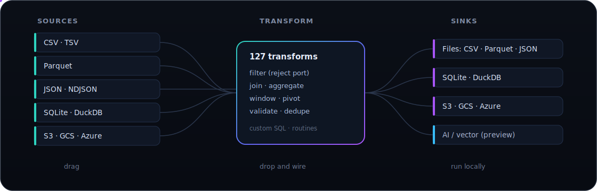
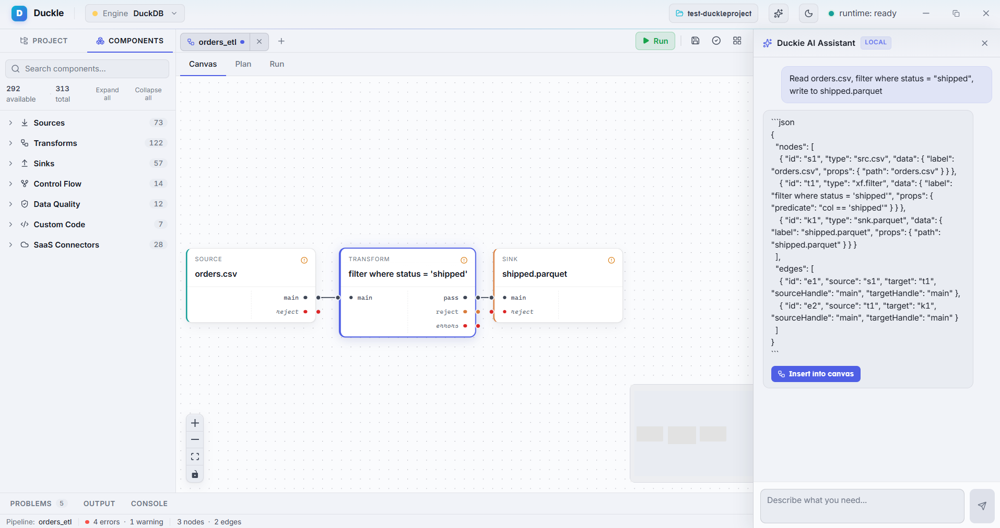

<div align="center">



<h3>The local-first data studio with a built-in AI assistant.</h3>

<p><b>Duckle</b> is an open-source desktop ETL / ELT studio. Drag a pipeline onto the canvas, describe what you need in plain English to <b>Duckie</b> (the on-device AI assistant), and execute at native speed through DuckDB. 290+ connectors, 50+ transforms, a built-in scheduler, and a chat assistant that runs entirely on your CPU. Ships as a ~9 MB desktop app. No cloud, no servers, no lock-in.</p>

<p>


</p>

</div>

---

## What is Duckle?

A visual data pipeline studio that runs on your laptop. Drag sources, transforms, validators, and sinks onto a canvas. Wire them together. Press **Run**. Duckle compiles the graph to SQL and executes it through a real columnar engine, with live previews, generated SQL on every node, and zero hidden state.

Three things make Duckle different from the heavyweights and the toy ETL tools:

1. **An AI assistant that ships in the box.** Describe the pipeline you want in English; Duckie writes the JSON and drops it onto the canvas. The model runs locally - no API key, no telemetry, no cloud round-trip.
2. **290+ connectors at install time.** Files, lakehouses, SQL databases, warehouses, NoSQL, vector DBs, streaming brokers, SaaS REST/GraphQL APIs, even FTP and IMAP - working today, not coming-soon.
3. **A tiny binary you can audit.** ~9 MB download. Engines install on first launch. Workspaces are plain files in a folder you choose. Diff them, branch them, ship them.

<div align="center">

</div>

---

## Meet Duckie - the local AI pipeline assistant

> Describe what you need. Duckie writes the pipeline.

<p align="center">

</p>

The sidebar on the right is **Duckie AI Assistant** - powered by **Qwen 2.5 Coder 1.5B** running through **llama.cpp**, downloaded once (~1.1 GB) and then run entirely on your CPU. Ask in plain English; Duckie streams back a valid Duckle pipeline definition. One click drops it onto the canvas, ready to inspect, tweak, and run.

| | |
|---|---|
| **Truly local** | The Qwen model runs as a `llama-server` subprocess on `127.0.0.1`. No API keys. No network calls. Disconnect your wifi and it keeps working. |
| **Streamed responses** | Tokens arrive as they're generated, with a blinking caret in the bubble. No "wait 20 seconds for the spinner to vanish" UX. |
| **One-click insert** | When Duckie produces a JSON pipeline, an **Insert into canvas** button appears. The graph populates with positioned nodes, wired edges, and the props the model chose. |
| **Bring-your-own-model option** | The chat plumbing is the same OpenAI-compatible HTTP interface used by `xf.ai.llm` / `xf.ai.embed` connectors. Point `baseUrl` at Ollama, llama.cpp, Cohere, OpenAI, Voyage - anything that speaks the OpenAI shape. |
| **Sandboxed** | The model has no fs / net / tool access. It can only emit text - your pipeline JSON. |

---

## Why Duckle is different

| | |
|---|---|
| **Visual, never opaque** | The canvas compiles to SQL you can read, and every node has a live preview tab. No black box. |
| **Local-first AI** | An assistant that runs on your laptop without an API key. Your prompts, your data, your machine. |
| **Tiny binary, no bundled DB** | ~9 MB app. DuckDB downloads on first launch with a guided step. AI engine is opt-in. |
| **Native speed** | Execution runs through DuckDB: vectorized, columnar, local. A clean-and-export job that crawls in a spreadsheet finishes in milliseconds. |
| **Git-friendly by design** | Pipelines, connections, contexts, and routines persist as plain files in a folder you pick. Diff them, branch them, review them. |
| **290+ connectors that work** | Files, databases, warehouses, lakehouses, object stores, SaaS APIs, NoSQL, streaming brokers, vector DBs, FTP, IMAP, SMTP. Each is covered by tests. |
| **Honest about scope** | Single-machine and embedded by design. Built to make local and small-team data work fast, not to replace a distributed warehouse. |
| **Open source** | Dual-licensed MIT OR Apache-2.0. Yours to use, fork, and extend. |

---

## Status

Duckle is in **public beta**. The visual designer, the DuckDB execution engine, the scheduler, the cloud connectors, and the Duckie AI assistant all work today and are covered by 170+ integration tests across Linux, macOS, and Windows. The catalog is still growing and APIs may evolve before 1.0, but the day-to-day surface is stable enough for real work.

**Scope, stated plainly:** Duckle is a single-machine, embedded studio. If you outgrow one box, point Duckle's output at the system that scales (a warehouse, an object store, a lakehouse). It will not pretend to be a cluster.

The component palette ships **313 nodes** so the roadmap is visible in the product itself:

- **292 available** runs on the DuckDB engine today
- **5 preview** is configurable in the designer (drag, wire, set properties); execution is being wired engine-by-engine
- **16 planned** is reserved in the palette but not yet executable - see [`docs/roadmap.md`](docs/roadmap.md)

---

## Screenshots

<p align="center">
  
  <br/>
  <sub>The visual designer: source -> filter -> sink, with the generated SQL one click away on every node.</sub>
</p>

<p align="center">
  
  
</p>
<p align="center">
  <sub>Left: component palette with one-click schema autodetect. Right: sink configuration with write modes, compression, and partitioning, in dark theme.</sub>
</p>

<p align="center">
  
  <br/>
  <sub>Duckie AI Assistant: describe the pipeline, get a one-click insert.</sub>
</p>

---

## Capabilities

Duckle is not a CSV tool with extras. It reads a broad set of formats and sources, ships a deep transform library, and writes to files, databases, object storage, vector DBs, message buses, and email.

### Sources (73 available)

| Group | Connectors | Status |
|---|---|---|
| **Files** | CSV, TSV, Parquet, JSON, JSONL / NDJSON, Excel (.xlsx), YAML, TOML, Fixed-width (mainframe / banking positional dumps), XML (slash-separated rowPath), Apache Avro (.avro / .ocf, pure-Rust) | Available |
| **Geospatial files** | GeoJSON, Shapefile, GeoPackage, KML, GPX, GML via the `spatial` extension | Available (lazy-loaded) |
| **Lakehouse table formats** | Apache Iceberg, Delta Lake, DuckLake | Available |
| **Embedded databases** | SQLite (read tables), DuckDB (read tables or run a query) | Available |
| **Network relational DBs** | PostgreSQL, MySQL, MariaDB, CockroachDB | Available (live CI for PG + MySQL) |
| **Network relational DBs** | SQL Server (TDS), Oracle (Instant Client at runtime), ClickHouse (HTTP API) | Available |
| **Network relational DBs** | IBM DB2, generic JDBC | Planned |
| **Object storage** | Amazon S3, Google Cloud Storage, Azure Blob, HTTP(S), MinIO, Cloudflare R2, Backblaze B2 | Available (live CI for MinIO) |
| **Cloud warehouses** | MotherDuck, Snowflake (SQL API + PAT/JWT), BigQuery, Redshift (postgres ATTACH), Databricks SQL (Statement Execution + chunk follow), Azure Synapse (TDS) | Available |
| **Streaming** | Apache Kafka / Redpanda (pure-Rust `rskafka`), NATS JetStream, GCP Pub/Sub (REST + auto-ack), RabbitMQ (`lapin` AMQP), AWS Kinesis (HTTP + SigV4 - no AWS SDK) | Available |
| **Streaming** | Pulsar, Event Hubs, multi-shard Kinesis | Planned |
| **APIs and SaaS (REST)** | Salesforce, HubSpot, Pipedrive, Zendesk, Intercom, Stripe, QuickBooks, Xero, Shopify, Notion, Airtable, Asana, Trello, ClickUp, Monday.com, GitHub, GitLab, Linear, Jira, Slack, Discord, Telegram, Twilio, Mailchimp, SendGrid, Segment - thin pre-configured wrappers over `src.rest` / `src.graphql` | Available |
| **APIs (protocols)** | OData v4 (follows `@odata.nextLink`), SOAP / generic XML APIs (XML response parsing with namespace local-name match) | Available |
| **NoSQL and search** | MongoDB (official driver), Cassandra / ScyllaDB (CQL), Elasticsearch / OpenSearch (from+size + search_after), Redis (SCAN + GET), CouchDB (`_all_docs`), DynamoDB (HTTP + SigV4 - no AWS SDK; auto-unwraps typed attributes) | Available |
| **Vector / AI databases** | pgvector (postgres ATTACH), Qdrant (`/points/scroll`), Weaviate (`/v1/objects`), Milvus (`/v1/vector/query`) | Available |
| **Vector / AI databases** | Pinecone (no list-all-vectors API), Chroma, LanceDB | Preview |
| **File transfer** | FTP / FTPS (pure-Rust `suppaftp` with glob filter and base64-content per file) | Available |
| **Mailbox** | IMAP (rustls TLS, `mail-parser`) - basic auth today, OAuth (gmail / o365) on the roadmap | Available |
| **Webhook listener** | Binds `127.0.0.1:port`, collects N inbound HTTP requests with a timeout, parses JSON-object / JSON-array bodies into rows | Available |
| **Desktop** | System clipboard (pure-Rust `arboard`, auto-detects JSON-array shape) | Available |
| **Repos** | Git (commit log or file tree from a local working copy; shells out to system `git` CLI) | Available |

### Transforms (122 available)

| Group | Operations |
|---|---|
| **Fields** | Map (visual row mapper), Project / Select, Cast, Rename, Add / Drop / Reorder Column, Coalesce, UUID v4 |
| **Rows** | Filter (visual or raw SQL, with reject port), Distinct, Sample, Top N / Limit, Sort, Skip, Top N per Group, Forward Fill |
| **Aggregate** | Group By, Rollup, Cube, Count, Window Aggregate, Cumulative, Approx Quantile (t-digest), Approx Count Distinct (HyperLogLog) |
| **Join** | Inner, Left, Right, Full Outer, Cross, Lookup, Semi, Anti, Spatial Join |
| **Set operations** | Union, Union All, Intersect, Except / Minus |
| **Window** | Row Number, Rank, Dense Rank, Lead, Lag, First Value, Last Value, NTile |
| **Strings** | Regex Replace, Regex Extract, Regex Match, Split, Concat, Trim, Case Change, Length, Substring, Format, Hash (md5 / sha1 / sha256), IP Parse, URL Parse, Text Similarity (Levenshtein / Jaro-Winkler / Jaccard), Base64, Pad, Text Match |
| **Date / Time** | Parse, Format, Extract Part, Date Diff / Add, Truncate, Timezone Convert, Time Bin, Current Timestamp, Epoch Convert |
| **Numeric** | Round, Modulo, Absolute, Logarithm, Power, Square Root, Bucketize, Z-Score, Clamp, Sign |
| **JSON / nested** | Parse, Stringify, Flatten, JSONPath Extract, Merge Objects, Array Aggregate |
| **Array** | Explode / Unnest, Collect List, Element At, Contains, Distinct, Length |
| **Pivot / shape** | Pivot, Unpivot, Denormalize, Normalize, Transpose |
| **CDC / SCD** | Diff Detect, SCD Type 1, SCD Type 2 (valid_from / valid_to / is_current), Merge / Upsert |
| **AI / Search** | **Vector Similarity Search** (cosine / L2 / inner product over FLOAT[N] via `vss`), **Full-Text Search** (BM25 via `fts`), **Embeddings** (OpenAI-compatible `/v1/embeddings`), **LLM Transform** (per-row chat completion with `{column}` templates), **Classify** (LLM-backed, normalizes to UNKNOWN), **Text Chunker** (RAG-ready, pure local), **PII Redact** (regex - emails / phones / SSNs / cards), **Semantic Dedupe** (cosine over precomputed embeddings) |
| **Geospatial** | Spatial Distance (ST_Distance), Spatial Buffer (ST_Buffer), Spatial Intersects (ST_Intersects) |
| **Debug** | Log Rows, Assert (hard-fail on SQL predicate violation) |

> **All 6 AI transforms ship today.** Three need a model API (LLM, Classify, Embeddings) and ride the apiKey-in-props pattern; three are pure-local (Chunk, PII Redact, Dedupe).

### Data quality (12 available)

Validators split their input: passing rows continue on the main port, failures route to a **reject** port you can sink, count, or inspect.

| Component | Behavior |
|---|---|
| **Not-Null Check** | Pass rows with no nulls in the chosen columns |
| **Range Check** | Pass rows inside a numeric range (inclusive or exclusive) |
| **Regex Match** | Pass rows whose column fully matches a pattern |
| **Uniqueness Check** | Pass the first row per key; route duplicates to reject |
| **Schema Validate** | Reject rows where any expected column is null |
| **Column Profile** | Per-column stats (count, null %, distinct, min / max, quartiles) via `SUMMARIZE` |
| **Describe** | Column names + types of the input |
| **Histogram** | Value frequencies for one column, most-frequent first |
| **Standardize** | Trim + case-normalize + collapse inner whitespace, in place |
| **Fuzzy Deduplicate** | Keep the first row per near-duplicate cluster |
| **Record Match** | Self-join: emit pairs of rows above a similarity threshold |
| **Address Cleanse** | Address parsing / normalization (planned - needs external lib) |

### Custom code (7 available)

| Capability | What it does |
|---|---|
| **Inline SQL** | Write a `SELECT`; the upstream node is exposed as `input`, result runs as a real materialized stage |
| **SQL Template** | Parameterized SQL with `${context.var}` substitution |
| **SQL Routines** | Reusable, named SQL saved in the workspace |
| **Shell** | Run any shell command; emits `{stdout, stderr, exit_code, duration_ms}`. Platform-aware default shell. Optional `timeoutMs` kills the child. |
| **WebAssembly UDF** | Per-row WASM transform via pure-Rust `wasmi`. Sandboxed (no fs / net / env). Works with any WASM toolchain (Rust, AssemblyScript, C, TinyGo). |
| **JavaScript UDF** | Per-row JS transform via pure-Rust `boa` interpreter. Sandboxed. Define a `transform(row)` function. |
| **Python / Rust UDFs** | Embedded-language stages | Planned |

### Sinks (57 available)

| Group | Connectors | Status |
|---|---|---|
| **Files** | CSV, TSV, Parquet (ZSTD), JSON, JSONL / NDJSON, Excel (.xlsx), YAML, TOML, XML (configurable wrappers), Avro (schema inferred from first row). Parquet + CSV support Hive-partitioned writes | Available |
| **Geospatial files** | GeoJSON, GeoPackage, Shapefile, KML, GPX via GDAL | Available (lazy-loaded) |
| **Lakehouse** | Apache Iceberg (full table layout), DuckLake | Available |
| **Embedded databases** | SQLite, DuckDB | Available |
| **Network relational DBs** | PostgreSQL, MySQL, MariaDB, CockroachDB - modes: **overwrite**, **append**, **truncate**, **upsert** (ON CONFLICT / ON DUPLICATE KEY) | Available (live CI for PG + MySQL) |
| **Network relational DBs** | SQL Server / Azure Synapse (TDS, multi-row VALUES batched), Oracle (Instant Client; INSERT ALL), ClickHouse (HTTP JSONEachRow) | Available |
| **Network relational DBs** | IBM DB2, generic JDBC | Planned |
| **Object storage** | S3, GCS, Azure Blob via DuckDB `httpfs` (MinIO / R2 / B2 via endpoint) | Available |
| **Cloud warehouses** | MotherDuck, Snowflake (PAT or JWT RS256), BigQuery, Redshift, Databricks SQL, Azure Synapse | Available |
| **HTTP APIs** | REST (POST/PUT/PATCH batched JSON-array), Webhook (one POST per row), GraphQL mutations | Available |
| **Email (SMTP)** | Per-row SMTP send via pure-Rust `lettre` + rustls. Plain text v1; HTML + attachments follow. | Available |
| **NoSQL** | MongoDB (insert_many batched), Cassandra / ScyllaDB (CQL), Elasticsearch / OpenSearch (`_bulk` NDJSON), Redis (pipelined SET) | Available |
| **NoSQL** | DynamoDB | Planned |
| **Streaming** | Kafka / Redpanda (`rskafka`), NATS JetStream, GCP Pub/Sub (REST + OAuth2), RabbitMQ (`lapin`) | Available |
| **Streaming** | Pulsar, Kinesis | Planned |
| **Vector / AI databases** | pgvector, Pinecone (`/vectors/upsert`), Qdrant (`/points` PUT), Weaviate (`/v1/batch/objects`), Milvus (`/v1/vector/insert`) | Available |
| **Vector / AI databases** | Chroma, LanceDB | Preview (need vendor SDK) |

### Control flow (14 available)

| Component | What it does |
|---|---|
| **Replicate / Tee** | Send the same data to multiple downstream outputs |
| **Merge Streams** | Concatenate multiple input streams (UNION ALL) |
| **Switch / Conditional Split** | Route rows to `case_1..N` outputs by boolean (first match wins); `default` for unmatched |
| **Wait / Delay** | Sleep `N ms / s / min / h` before passing rows through |
| **Throttle** | Inter-stage delay derived from a rows-per-second target |
| **Checkpoint** | Pass rows through and also write a parquet snapshot to a path |
| **Dead Letter Queue** | Terminal sink for rejected rows (JSON / CSV / Parquet) |
| **Run Pipeline** | Inline-execute another pipeline file (`ctl.runpipeline`) |
| **Iterate** | Run a sub-pipeline N times with `${ITER_INDEX}` substitution |
| **For Each** | Run a sub-pipeline once per input row with `${ITER_ITEM_<FIELD>}` substitution |
| **Try / Catch** | Install a fallback sub-pipeline if the wrapped stage fails |
| **Retry** | Per-stage retry policy (configure on Advanced tab) |
| **Schedule** | Cron / interval / file-watch triggers via the orchestration crate |

### Advanced settings (per-node)

Every node has an **Advanced** tab with fields the engine honours at run time:

| Field | What it does |
|---|---|
| **Retry attempts** | Total tries on failure (1 = no retry). Sleeps `backoff * attempt` ms between attempts. |
| **Retry backoff (ms)** | Inter-attempt sleep, linearly scaled by attempt index. |
| **Memory limit (MB)** | `PRAGMA memory_limit` applied to this stage only. |
| **Log row count** | Print the post-stage rowcount to the run output. |

### Orchestration and workspace

| Capability | What it does |
|---|---|
| **Run feedback** | Streaming run events light nodes up stage by stage, with per-node row counts, real mid-query cancel, and run history. |
| **Schedules** | Cron, fixed-interval, and file-watch triggers, driven by an in-process scheduler. |
| **Context variables** | Per-environment variables; bind any field to one via a Manual / Context dropdown, or reference `${var}` inline. Resolved at run time. |
| **Cloud credentials** | Saved S3 / GCS / Azure connections become DuckDB SECRETs; cloud reads / writes go through `httpfs`. S3-compatible endpoints (MinIO / R2 / B2) supported via `ENDPOINT` + `URL_STYLE`. |
| **Workspace** | Pipelines, connections, contexts, documents, and routines persist as plain JSON and Markdown files in a folder you choose. |

---

## Clean data before it reaches your AI

Models inherit the quality of their inputs. RAG indexes, embedding stores, and training sets quietly accumulate duplicates, nulls, malformed rows, mixed encodings, and inconsistent schemas. Duckle is built to scrub that data before it lands in a vector store:

- **Deduplicate** with exact Distinct, Uniqueness, and **Fuzzy Deduplicate** (Jaro-Winkler / Levenshtein); use **Record Match** to find near-duplicate pairs with a similarity score
- **Semantic dedupe** with `xf.ai.dedupe` over a precomputed embedding column
- **Profile + describe** every column up front (Column Profile, Describe, Histogram) so issues surface before they reach a model
- **Validate and filter** malformed, empty, or out-of-range records and route failures to a reject port
- **Normalize** types, encodings, casing, and null handling across messy sources (Standardize, Cast, regex / string transforms)
- **Redact PII** (emails, phones, SSNs, credit cards) via `xf.ai.pii` before embedding
- **Chunk + embed** long text via `xf.ai.chunk` -> `xf.ai.embed` for RAG indexing
- **Classify** rows with an LLM (`xf.ai.classify` constrains the model to one of N user-supplied categories)
- **Retrieve with both halves of hybrid search**, locally, no model API required: **Vector Similarity Search** (cosine / L2 / inner product) and **Full-Text Search** (BM25)
- **Land it in your store** - pgvector ships, and **Pinecone**, **Qdrant**, **Weaviate**, **Milvus** all have working sinks that POST batches through each vendor's HTTP API

---

## Engines

Duckle ships a thin shell and installs its engines on first launch.

| Engine | Role | Status |
|---|---|---|
| **DuckDB** | Default execution engine: analytics, file formats, cloud reads, SQL pushdown. Tracking **v1.5.3** (latest stable). | Working |
| **Duckie AI Assistant** | Local chat assistant via **llama.cpp** + **Qwen 2.5 Coder 1.5B GGUF**. Downloads ~1.1 GB; runs entirely offline once installed. Managed as a `llama-server` subprocess exposing an OpenAI-compatible API on `127.0.0.1`. | Installable |
| **SlothDB** | Alternate embedded analytical engine ([SouravRoy-ETL/slothdb](https://github.com/SouravRoy-ETL/slothdb)), installed the same way and selectable per pipeline. | Installable |
| **Native** | In-process Rust streaming / incremental engine. | Planned |

### First-launch extension pre-fetch

When the installer downloads the DuckDB CLI it also pre-fetches the extensions Duckle uses, with per-extension progress, so the first time you touch a Postgres source or an Iceberg table there is no surprise network hop mid-pipeline:

`httpfs` (S3 / GCS / HTTP), `azure` (Azure Blob native), `sqlite`, `postgres`, `mysql`, `excel`, `iceberg`, `delta`, `ducklake`, `vss`, `fts`.

`spatial` is lazy-loaded (~50 MB GDAL bundle) - it installs on first use of a geospatial source/sink to keep the initial download small.

---

## Quickstart (60 seconds)

1. **Download** the latest [release](https://github.com/SouravRoy-ETL/duckle/releases) for your OS, or build from source below.
   - Windows: `Duckle-windows-x64.exe`
   - macOS: `Duckle-macos-arm64`
   - Linux: `Duckle-linux-x64`
2. **Launch it.** On first run, Duckle offers to install its engines. Click **Install DuckDB** (small, fast). Optionally **Install Duckie AI Assistant** (~1.1 GB) if you want the chat assistant.
3. **Pick a workspace folder.** Pipelines and config live as plain files here.
4. **Build a pipeline two ways:**
   - **Click + drag**: pull a **CSV source** in, point it at [`samples/orders.csv`](samples/orders.csv), hit **Autodetect schema**. Drag a **Filter**, wire it up. Drag a **Parquet sink** with an output path. Press **Run**, watch the nodes light up.
   - **Ask Duckie**: click the **Sparkles** icon (top-right of the toolbar), describe what you want ("read orders.csv, filter where status = 'paid', write to paid.parquet"), and click **Insert into canvas** when the assistant streams back a pipeline.

That's a real, native ETL pipeline, built and run in under a minute. CSV is just the easiest first node; swap in Parquet, JSON, S3, Snowflake, MongoDB, or Stripe the same way.

---

## How to use Duckle

1. **Sources** - drag a source onto the canvas and point it at a file, an embedded database, a cloud URL, or a SaaS endpoint. Click **Autodetect schema** to read the columns and a sample.
2. **Transforms** - drag transforms and wire them to the source's output port. Configure each in the properties panel; the **Preview** tab shows live rows and the **Plan** tab shows the generated SQL.
3. **Data quality** - drop in a validator (Not-Null, Range, Regex, Uniqueness). Passing rows continue on the main port; failures leave the **reject** port, which you can sink or inspect separately.
4. **Sinks** - finish with a sink (file, database, cloud, vector DB, message bus, email) and set its write mode.
5. **Run** - press **Run** to execute on DuckDB (or SlothDB). Nodes light up stage by stage; the **Output** and **Console** tabs report row counts, timing, and errors.
6. **Ask Duckie** - for any task you can describe in English, the AI assistant can sketch a pipeline. Iterate by editing the generated graph or asking follow-up questions.
7. **Reuse** - save Connections, Context variables, and SQL Routines in the workspace; reference `${context.var}` in any field. Everything persists as plain files you can commit.
8. **Schedule** - attach a cron, interval, or file-watch trigger to run a pipeline automatically.

---

## Build from source

**Prerequisites**

- [Rust](https://rustup.rs/) (stable)
- [Node.js](https://nodejs.org/) 18+ and npm
- [`cargo-tauri`](https://tauri.app/) CLI: `cargo install tauri-cli --version "^2"`
- Platform webview dependencies per the [Tauri prerequisites](https://tauri.app/start/prerequisites/). WebView2 is preinstalled on Windows 10 and 11.

**Clone and install**

```bash
git clone https://github.com/SouravRoy-ETL/duckle
cd duckle
npm --prefix frontend install
```

**Run in development** (hot-reloading frontend plus the native shell):

```bash
cargo tauri dev
```

**Build a release binary:**

```bash
# The --features custom-protocol flag is required: without it, tauri-codegen
# embeds the dev URL instead of the bundled frontend.
cargo build --release --manifest-path apps/desktop/Cargo.toml --features custom-protocol
```

Outputs land in `target/release/duckle` (or `duckle.exe`). The engine is not statically linked: DuckDB downloads at first launch, which is why the build is fast and the binary is tiny.

**Run the tests:**

```bash
cargo test                                                          # workspace unit + plan tests
DUCKLE_DUCKDB_BIN=/path/to/duckdb cargo test -p duckle-duckdb-engine # full integration suite
```

---

## Architecture

```
duckle/
  apps/desktop/         Tauri 2 shell: Tauri commands, engine installer, llama runtime, window
  frontend/             React 19 + Vite + TypeScript: the designer UI + chat panel
  crates/
    duckdb-engine/      Compiles the node graph to SQL and drives the DuckDB CLI
    slothdb-engine/     SlothDB adapter
    scheduler/          Cron / interval / file-watch triggers
    metadata/           Schema and type model
    plugin-sdk/         Connector / inspector traits
    connectors/         Source and sink connectors
    runtime, workflow-engine, transform-engine, stream-engine, execution-core
```

- The **frontend** (React with [@xyflow/react](https://reactflow.dev/)) is the visual designer; it talks to the Rust core over Tauri commands.
- **duckdb-engine** topologically sorts the graph, lowers each node into SQL, and executes by shelling out to the downloaded DuckDB CLI. Non-sink nodes materialize as tables so later stages can reference them; sinks become `COPY ... TO` statements; cancel kills the process. No statically linked database, so the binary stays small.
- **Duckie** is a `llama-server` subprocess on `127.0.0.1` exposing an OpenAI-compatible chat-completions API. The chat panel streams from it via SSE. The model is sandboxed: no fs, no net, no tools - it can only emit text.
- **Everything persists** to the workspace folder you choose, as plain JSON and Markdown files.

---

## Roadmap

A complete planned-component breakdown lives in [`docs/roadmap.md`](docs/roadmap.md). Highlights:

- [ ] **Multi-shard Kinesis** and **Pulsar** streaming (Pulsar blocked on `protoc` at build time)
- [ ] **Apache ORC** read / write (blocked on the Arrow version conflict between `orc-rust` and our workspace pin)
- [ ] **SFTP** source (blocked on the `aws-lc-sys` NASM build dep in `russh`)
- [ ] **OAuth-heavy SaaS** (Google Sheets, Excel Online, full Salesforce OAuth, Gmail / O365 IMAP)
- [ ] **Embedded Python / Rust** code stages (current code.* family: SQL, Shell, JavaScript, WebAssembly all ship)
- [ ] **Hosted documentation site**
- [ ] **Plugin marketplace** via the connector SDK
- [ ] **In-process Native engine** - a Rust streaming / incremental executor as an alternative to shelling out to the DuckDB CLI

---

## Contributing

Contributions, issues, and ideas are welcome. Duckle is young and there is a lot of green field. Open an issue to discuss a change before a large PR, match the existing code style, and keep changes focused. Run `cargo test` and `npm --prefix frontend run build` before submitting. See [CONTRIBUTING.md](CONTRIBUTING.md).

---

## License

Licensed under either of **MIT** or **Apache-2.0** at your option.

---

<div align="center">
<sub>Built with Rust, Tauri, React, and DuckDB by <a href="https://github.com/SouravRoy-ETL">Sourav Roy</a></sub>
</div>

<!-- Suggested GitHub topics: etl, elt, data-engineering, data-pipeline, duckdb, rust, tauri, react, typescript, local-first, embedded, drag-and-drop, data-cleaning, vector-database, ai, ai-assistant, llm, llama-cpp, qwen, desktop-app, no-code, low-code, sql, pipeline-builder -->
